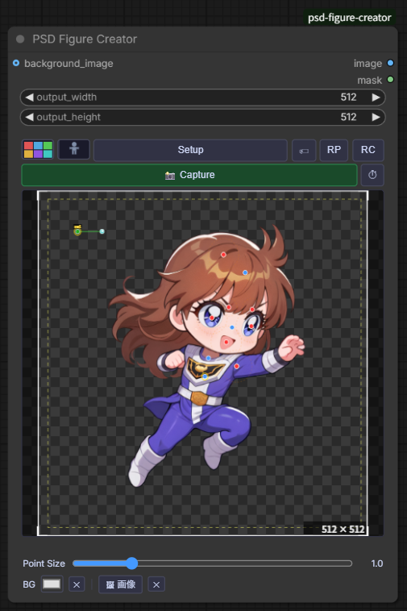
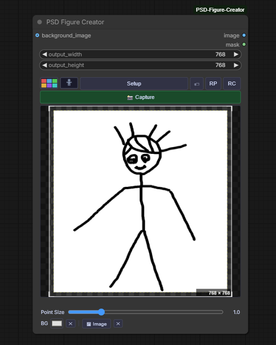
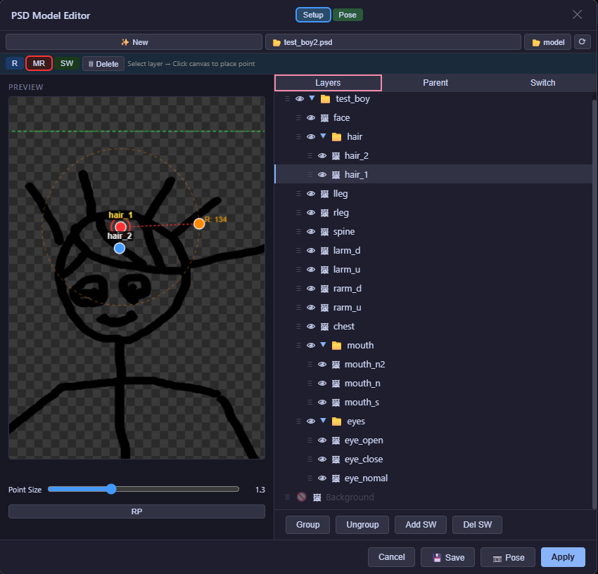
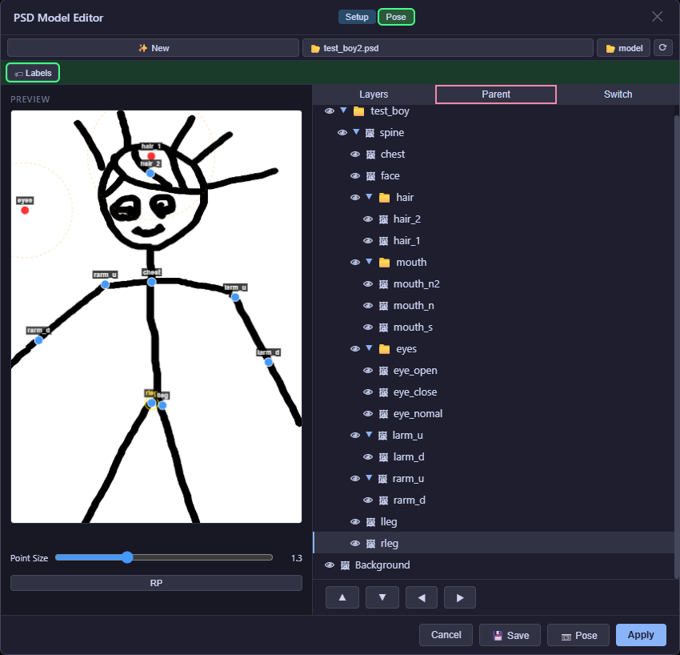
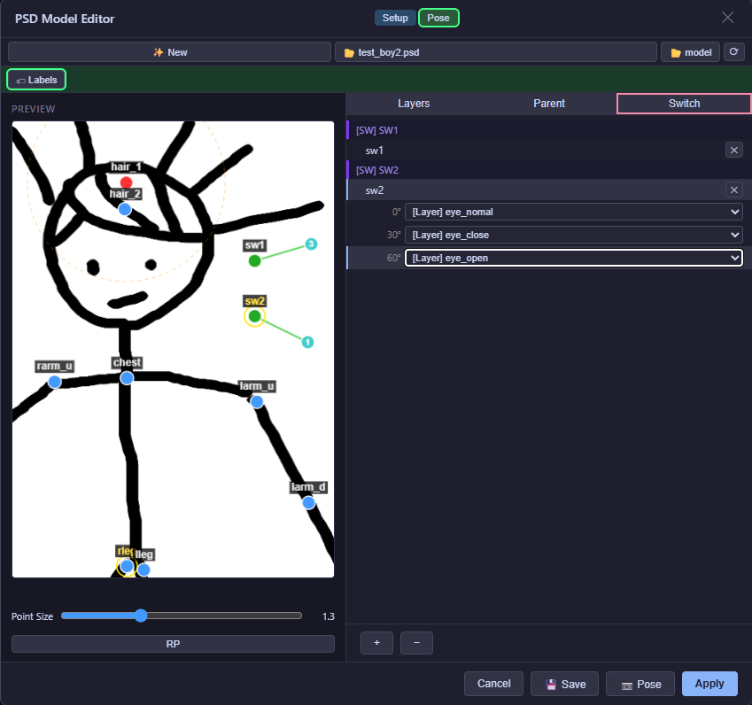
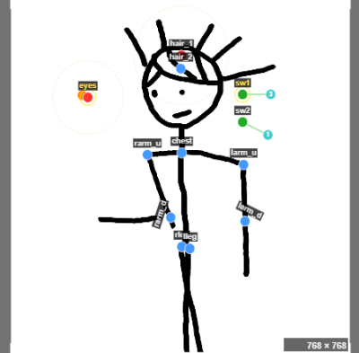
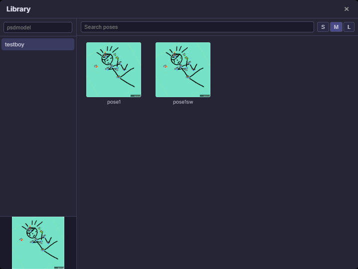
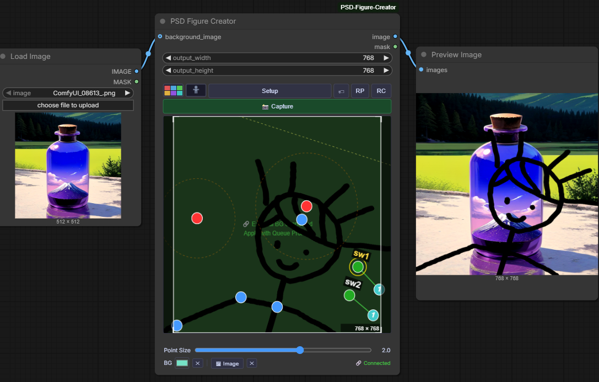

# ComfyUI PSD Figure Creator

**Language / 言語 / 语言:** [English](README.md) | 日本語 | [中文](README.zh.md)

PSDファイルを読み込み、レイヤーにリグポイントを配置してポーズをとらせ、
結果を `IMAGE` + `MASK` として出力する ComfyUI カスタムノードです。

---

## 機能

- **インタラクティブレイヤービューア** — 表示/非表示の切り替え、レイヤー名・グループ名のリネーム
- **カスタムグループ** — レイヤーをグループにまとめ、ドラッグで描画順を変更
- **リギングシステム** — キャンバス上でレイヤーにコントロールポイントを配置:
  - **R**（青）— 回転専用
  - **MR**（赤/オレンジ）— 移動 ＋ 回転
  - **LSW**（緑）— Lスイッチ: ハンドルを回転させて最大12スロットを切り替え。**+L** で個別レイヤー（1スロット）、**+P** でグループ/フォルダをレイヤーごとに展開（Piece、Nスロット）、**+C** でグループ/フォルダ全体を合成して1スロットとして登録（Composite）
  - **PSW**（白）— Pスイッチ: ハンドルを回転させて登録済みポーズを切り替え。30°刻みのスロットに R/MR のポーズ状態を登録し、最大12スロットまで対応
- **セットアップモード / ポーズモード** — セットアップでリグを設定し、ポーズで動かす
- **キーフレームアニメーション** — 特定フレームにポーズを記録し、フレーム間を自動補間（位置は線形補間、角度は最短回転パス補間）。再生プレビューと WebM 動画エクスポート（Chrome/Edge 推奨）に対応。アニメーションプロジェクトをライブラリに保存・再読み込みできる
- **ライブラリ** — モデルファイル（`.psd-model.json`）・ポーズファイル・キーフレームプロジェクトを保存・読み込み
- **背景オプション** — チェッカーパターン / 単色 / ローカル画像 / 上流の `IMAGE` ノード
- **Capture → Queue Prompt** — 現在のキャンバス状態を出力画像として確定
- **i18n** — `navigator.language` で自動言語切り替え（日本語 / 英語 / 簡体字中国語）

---

## スクリーンショット

### アニメーション出力サンプル


### ノード



### ノード — キーフレームアニメーションパネル展開時



### エディタ — レイヤータブ（Setup モード）



### エディタ — ペアレントタブ



### エディタ — スイッチタブ



### ノードプレビュー — リグ設定済み



### ライブラリ — モデル & ポーズブラウザ



### ComfyUI ワークフロー内での Capture



---

## インストール

```bash
# 1. このフォルダを ComfyUI の custom_nodes ディレクトリにコピーまたはシンボリックリンク
#    例: ComfyUI/custom_nodes/psd-image-loader/

# 2. Python 依存パッケージをインストール
pip install psd-tools
```

ComfyUI を再起動します。ノードは **image/psd → PSD Figure Creator** として表示されます。

---

## サンプルデータ

`user_data/` ディレクトリにすぐ試せるサンプルが同梱されています：

| ファイル | 説明 |
|---|---|
| `user_data/sample_1.psd` | サンプルキャラクター PSD |
| `user_data/models/sample.psd-model.json` | 設定済みモデル（R/MR リグ・ペアレント階層・SW スイッチ） |
| `user_data/poses/pose1.pose.json` | サンプルポーズ 1 |
| `user_data/poses/pose2.pose.json` | サンプルポーズ 2 |

**使い方：**
1. `user_data/sample_1.psd` を `ComfyUI/input/psd/` にコピーする
2. **Editor** を開いて **📂 model** をクリック — ライブラリに `sample` が表示される
3. モデルを読み込む。サンプルポーズはポーズライブラリから利用可能

> **PSD Loader（v2.16 以前）からのアップグレード:**  
> ワークフロー JSON に `"PSDLoader"` が含まれている場合は `"PSDFigureCreator"` に書き換えてください。

---

## 別PCへの移行

別の PC に環境を移す場合は、以下の2つを別々に転送する必要があります。

### 1. PSD ファイル
PSD ファイルは ComfyUI の `input/psd/` ディレクトリに保存されています。
```
ComfyUI/input/psd/  →  新PC の ComfyUI/input/psd/ にコピー
```

### 2. ライブラリデータ（モデル・ポーズ）
ライブラリデータはカスタムノードフォルダ内の `user_data/` に保存されています。
```
ComfyUI/custom_nodes/PSD-Figure-Creator/user_data/  →  新PC の同じパスにコピー
```

> **ワークフロー JSON を持ち込む場合の注意:** ワークフローに `psd_filename` が保存されていても、PSD ファイルが新PC の `input/psd/` になければ「レイヤー情報の取得に失敗」のアラートが出ます。その場合は **Setup ボタンをそのまま押す**とモーダルが開くので、「Open PSD」ボタンから PSD を再選択してください（v0.5.2 以降）。

---

## ノードの入出力

| パラメータ | 型 | 説明 |
|---|---|---|
| `psd_filename` | STRING | `input/psd/` ディレクトリ内の PSD ファイルパス |
| `layer_config` | STRING | UI エディタが生成する JSON 文字列 |
| `output_width` | INT | 出力幅（ピクセル、1px 単位で指定可能）。0 = PSD 本来のサイズ |
| `output_height` | INT | 出力高さ（ピクセル、1px 単位で指定可能）。0 = PSD 本来のサイズ |
| `image_data` | STRING | Capture からの Base64 PNG（サーバー合成をスキップ） |
| `background_image` | IMAGE | 最背面に合成する上流ノードの画像（オプション） |

| 出力 | 型 | 説明 |
|---|---|---|
| `image` | IMAGE | 合成済み RGB 画像 |
| `mask` | MASK | アルファチャンネル |

---

## UI 概要

```
[✨ 新規] [📂 PSD ファイル]  [⟳]
[Editor]             [⏱] [RC]
[📸 Capture]
 ┌──────────────────────────────────┐   ← キーフレームパネル（⏱ で開閉）
 │ [+KF][🗑KF]|[+CK][-CK]|[↔]|[0][◀][f]/[t][▶] │
 │ ◆────◆──────── タイムライン ────────── │
 │ [New] FPS[24] [💾Proj] [🎬WebM]  [▶▶] [■] │
 └──────────────────────────────────┘
 ┌────────────────────────┐
 │  プレビューキャンバス    │
 └────────────────────────┘
 Point Size: ─────────────
 BG: [■ 色][✕] [🖼 画像][✕] [🔗 外部接続中?]
```

- **Editor** — フルスクリーンのセットアップ/ポーズモーダルを開く
- **⏱** — キーフレームアニメーションパネルの開閉
- **RC** — カメラリセット（パン・ズーム）
- **✨ 新規** — リギング・SW レイヤー・ポーズをすべてクリア（確認ダイアログあり）

### セットアップモーダルのタブ

| タブ | 内容 |
|---|---|
| レイヤー | レイヤーツリー、カスタムグループ管理、リグモードボタン（R / MR / LSW / PSW） |
| ペアレント | トランスフォームを伝播させる親子階層 |
| Lスイッチ | LSW レイヤー一覧とグループスロットエディタ |
| Pスイッチ | PSW ポイント一覧、スロット管理、ポーズ登録 |

---

## リグシステム

### R — 回転
青いドット。ポーズモードでドラッグすると、配置したピボットを中心にレイヤーを回転させます。

### MR — 移動 ＋ 回転
赤いオリジン ＋ オレンジのハンドル。ハンドルをドラッグすると移動と回転を同時に行います。

### LSW — Lスイッチ
緑のオリジン ＋ シアンのハンドル。ハンドルを回転させると登録したスロットを 30° ステップで切り替えます（最大 12 スロット × 30° ＝ 360°）。  
セットアップモードではオリジンをドラッグして位置を変更。ハンドルで半径と初期角度を調整します。

**スロットのエントリ種別**（Lスイッチタブで設定）:

| ボタン | エントリ | バッジ | スロット数 |
|---|---|---|---|
| `+L` | 個別 PSD レイヤー | `[L]` | 1 スロット |
| `+P` | カスタムグループ / PSD フォルダ（Piece） | `[P]` | メンバー / リーフレイヤー数 |
| `+C` | カスタムグループ / PSD フォルダ（Composite） | `[C]` | 1 スロット（全メンバーを合成） |

登録済みのグループやフォルダが削除された場合、該当行が赤背景 ＋ ⚠ アイコンで「孤立エントリ」として表示されます。新しいエントリを追加する前に手動で削除してください。

### PSW — Pスイッチ
白いオリジン ＋ 紫のハンドル。ハンドルを回転させて登録済みポーズ（R/MR の状態）を切り替えます。

**使い方**（Pスイッチタブで設定）:

1. Setup モードで **PSW** ボタンを押し（初回は PSW レイヤーを自動作成）、キャンバスをクリックしてポイントを配置
2. **`+Slot`** ボタンで 30° 刻みのスロットを追加（最大 12 スロット）、**`−Slot`** で最後のスロットを削除
3. **0° スロット**行を選択し、Pose モードでポーズを決めて **`+MLP`** で全レイヤーをまとめて登録、またはレイヤーツリーでレイヤーを選択して **`+SLP`** で1レイヤーを登録（**`−LP`** でクリア）
4. 0° 以外のスロットはスロット行をクリック → **`✏編集`** でポーズをロード → 調整 → **`✓確定`** で保存
5. ハンドル角度に応じて登録ポーズが自動適用される（0°〜30°→スロット0、30°〜60°→スロット1…）。可動域は **（スロット数 − 1）× 30°** でロック

複数の PSW ポイントは独立して動作し、それぞれのポーズが合成されます。

ノードの Capture ボタン左にある **`PSW` トグルボタン**で PSW をグローバルに ON/OFF できます。

| 状態 | 色 | 効果 |
|---|---|---|
| ON（デフォルト） | 青 | ハンドル角度に応じてプリセットポーズを適用 |
| OFF | 赤 | PSW 無効 — PSW 登録レイヤーも含めて R/MR で自由操作 |

PSW トグルの ON/OFF 状態は以下のすべてに保存・復元されます：

- **キーフレーム** — フレームごとに保存され、再生時に自動切り替え
- **ポーズ保存（📷 ポーズ / 右クリックポーズ+SW）** — ロード時にトグル状態を復元
- **モデル保存・ロード** — モデルファイルにトグル状態を含む
- **プロジェクト保存（ComfyUI ワークフロー）** — `layer_config` に永続化

---

## キーフレームアニメーション

ノードの **⏱** ボタンでキーフレームパネルを開閉します。

### 操作一覧

**Row A**

| ボタン / 入力フィールド | 操作 |
|---|---|
| `+KF` | 現在フレームにポーズ（表示状態・位置・角度）を記録 |
| `🗑KF` | 現在フレームのポーズキーフレームを削除（カメラデータは保持） |
| `+CK` | 現在フレームにカメラキーフレーム（zoom / x / y / roll）を記録 |
| `-CK` | 現在フレームのカメラキーフレームを削除（ポーズデータは保持） |
| `↔` | キー移動モードの切り替え: ON のときタイムライン上でキーフレームをドラッグ移動（プレイヘッドOFF） |
| `0` | フレーム 0 に移動 |
| `◀` / `▶` | 1フレーム前 / 次に移動 |
| フレーム番号入力 | 指定フレームにジャンプ |
| 総フレーム数入力 | アニメーションの総フレーム数を変更 |

**Row B**

| ボタン / 入力フィールド | 操作 |
|---|---|
| `New` | キーフレームを全削除してフレーム 0 にリセット（確認あり） |
| `FPS` | 再生・エクスポートのフレームレート（デフォルト 24） |
| `💾 Proj` | アニメーションプロジェクトをライブラリに保存（名前: `project-YYYYMMDDHHMMSS`） |
| `🎬 WebM` | WebM 動画ファイルとしてエクスポート（Chrome / Edge 推奨） |
| `▶` / `■` | 再生開始 / 停止（`▶` は 2 倍幅） |

### タイムライン

タイムラインキャンバスをクリック / ドラッグすると任意フレームにスクラブできます。記録済みキーフレームは **◆** マーカーで表示されます。

### 補間方式

| プロパティ | 補間方式 |
|---|---|
| 位置（tx / ty） | 線形補間（lerp） |
| 回転角度 | 最短回転パス補間（0° ↔ 360° のラップ処理あり） |
| SW ハンドル角度 | 最短回転パス補間 |
| PSW ハンドル角度 | 最短回転パス補間 |
| 表示状態（visibility） | 直前のキーフレーム値を維持（ステップ） |

### プロジェクト保存 / 読み込み

`💾 Proj` はキーフレームデータ（フレームリスト・総フレーム数・FPS）をライブラリの**ポーズ**欄に `_type: "kf_project"` として保存します。ライブラリから読み込むとタイムラインが復元され、フレーム 0 のポーズがキャンバスに適用されます。

キーフレームは `layer_config.keyframes` にも保存されるため、ComfyUI のワークフロー JSON を保存 / 読み込みすると自動的に復元されます。

---

## クリッピングレイヤー

Photoshop の「下のレイヤーにクリッピング」フラグが設定されたレイヤーは、レイヤーパネルと SW の `+L` ドロップダウンに **✂** バッジで表示されます。キャンバスコンポジターは `source-atop` ブレンドで描画します — 各クリッピングレイヤーは直下のベースレイヤーの不透明領域にマスクされます。クリッピングレイヤーに設置した R/MR リグはそのマスク領域内で通常通り機能します。クリッピングは PSD ルート直下・フォルダ内・カスタムグループ内のいずれでも適用されます。

> **⚠ ペアレント設定の注意:** ベースレイヤーにリグが設定されて動く場合、クリッピングレイヤーも一緒に動くには**ペアレントタブで同じ親**を設定する必要があります。親が設定されていない場合、クリッピングレイヤーはキャンバス上の元の位置に留まり、マスクの位置がずれます。

---

## 背景合成の優先順位（高 → 低）

1. **ComfyUI `background_image` 入力** — サーバー側合成（レターボックスリサイズ、アスペクト比保持）
2. **ローカル背景画像** — `🖼 画像` ボタンで読み込んだ画像をクライアント側で描画
3. **背景色** — カラーピッカーで選択した単色
4. **チェッカーパターン** — デフォルトの透明背景インジケータ

---

## ファイル構成

```
psd-image-loader/
├── __init__.py              # ノード登録
├── psd_loader_node.py       # PSDFigureCreatorNode
├── psd_utils.py             # psd-tools を使った合成処理
├── server.py                # aiohttp API ルート（upload / layers / preview / library）
├── requirements.txt
└── web/
    ├── js/
    │   ├── psd_loader.js    # フロントエンド（キャンバス・モーダル・リギング）
    │   └── i18n.js          # 翻訳辞書 + t() 関数
    └── css/
        └── psd_loader.css
```

---

## layer_config スキーマ

```jsonc
{
  "visibility":    { "<layerId>": true | false },
  "renamed":       { "<layerId>": "表示名" },
  "custom_groups": [{ "name": "...", "layer_ids": [...], "visible": true }],
  "layer_order":   [{ "id": "...", "children": [...] }],
  "rigging": {
    "<layerId>": {
      "r":         { "x": 0, "y": 0 },
      "mr":        { "x": 0, "y": 0 },
      "mr_radius": 40
    }
  },
  "pose": {
    "<layerId>": { "angle": 0, "tx": 0, "ty": 0 }
  },
  "sw_layers": [{
    "id": "...", "name": "sw1",
    "points": [{
      "id": "...", "name": "pt1",
      "x": 512, "y": 512,
      "radius": 60, "angle": 0,
      "groups": [
        "<layerId>",                                              // +L — 個別レイヤー、1 スロット
        { "type": "custom_group", "id": "...", "mode": "piece" },     // +P — メンバーレイヤー数のスロット
        { "type": "psd_group",    "id": "...", "mode": "composite" }  // +C — 1 スロット（合成）
        // mode 省略時は "piece" 扱い（後方互換）
      ]
    }]
  }],
  "psw_layers": [{
    "id": "...", "name": "PSW1",
    "points": [{
      "id": "...", "name": "PSW1",
      "x": 512, "y": 512,
      "radius": 80, "angle": 0,
      "slots": [
        { "degree": 0,  "pose": null },                          // 未登録
        { "degree": 30, "pose": { "<layerId>": { "angle": 0.5, "tx": 10, "ty": -5 } } }
      ]
    }]
  }],
  "keyframes": [
    {
      "frame": 0,
      "visibility": { "<layerId>": true },
      "pose":       { "<layerId>": { "angle": 0, "tx": 0, "ty": 0 } },
      "sw_angles":  { "<pointId>": 0 },
      "psw_angles": { "<pointId>": 0 }
    }
  ],
  "kf_total_frames": 60,
  "kf_fps": 24
}
```

---

## 動作環境

- **ComfyUI**（最新版）
- **Python 3.10+**
- **psd-tools ≥ 1.9.0**

---

## トラブルシューティング

### コンソールに `[INFO] Unknown image resource` / `Unknown tagged block` が表示される

```
[INFO] Unknown image resource 1092
[INFO] Unknown tagged block: <Tag.CAI: b'CAI '>, ...
```

**psd-tools** ライブラリが出力する情報メッセージです（エラーではありません）。PSD ファイルに psd-tools が未対応のメタデータ（生成塗りつぶし（Generative Fill）の `CAI` タグなど、最新の Photoshop が追加したリソース）が含まれている場合に表示されます。ファイルの読み込みと合成は正常に行われ、未知のデータはスキップされます。対処は不要です。

---

## ライセンス

MIT
